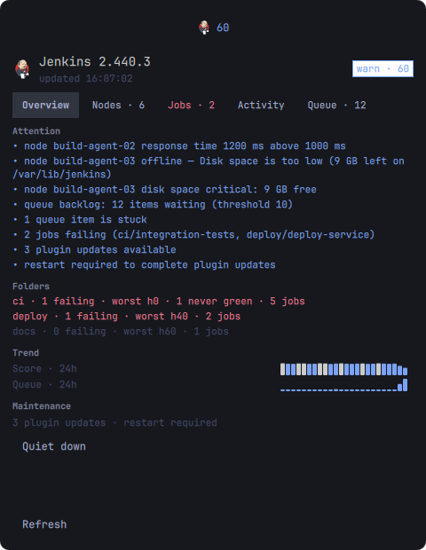

# Jenkins Health

An [Omarchy](https://omarchy.org) shell plugin (`h3nr1.d14z.jenkins`) that
watches a Jenkins CI controller and reports its health in the bar:

- **Live polling** of controller status, build nodes, build queue, job ball
  colors, and plugin updates (via the Jenkins REST API over `curl`).
- **Health scoring** (0–100) with levels `ok` / `warn` / `critical`,
  combining node offline/disk/response-time signals, queue backlog, stuck
  items, failing jobs, and pending maintenance.
- **Notification layer** for five categories: controller down/up, node
  changes (including per-node disk: low, critical, recovered, and
  state-unknown — a node whose monitors stop reporting is itself
  flagged), job failures, queue backlog, and maintenance (quiet-down,
  restart-required, plugin updates). Each category can be toggled off.
- **Safe actions** from the panel: quiet-down toggle, cancel a queue item,
  and take a node offline / back online.
- **Opt-in workspace wipe** (behind the `enableCleanWorkspace` setting,
  off by default): a per-node *Clean ws* action that lists the workspace
  directories under that node's default workspace root and deletes them
  after an explicit confirm.
- **Job depth** from a single tree query: Jenkins health scores, last
  build (result/duration/age), never-green detection, folder rollups,
  and an Activity feed of the most recent builds across the catalog.
- **Trend history** persisted across restarts (`~/.cache/jenkins-health/`
  history.json, mode 600): 24h score/queue sparklines on Overview and a
  per-node disk trend on the Nodes tab. Raw samples for the last hour,
  then bucketed; everything older than 24h is dropped.

Credentials never appear in a process argument list: the API token is read
from a file with mode 600 and handed to `curl` through a generated netrc
file (also mode 600).



## Setup

1. Create an API token in Jenkins (*your name → Security → API Token*) and
   store it:

   ```bash
   mkdir -p ~/.config/jenkins-health
   printf '%s' 'your-api-token' > ~/.config/jenkins-health/token
   chmod 600 ~/.config/jenkins-health/token
   ```

2. Add the widget to your bar and point it at your controller — set
   `jenkinsUrl`, `jenkinsUser`, and (optionally) `tokenFile` in the widget
   settings of `~/.config/omarchy/shell.json`.

## Using it

The bar chip shows the Jenkins butler logo with the health score
(0–100) colored by level — `ok` (≥95), `warn` (≥50), `critical`
(below). Click the chip to open the panel; middle-click to refresh
immediately. The panel has five tabs:

- **Overview** — controller card (version, last update, level) and an
  Attention list of everything currently wrong: offline or slow nodes,
  disk pressure, queue backlog, stuck items, failing jobs, pending
  updates. Below that, folder rollups (failing / total / worst health /
  never-green for the worst folders), 24h Score and Queue trend
  sparklines, and a Quiet down button.
- **Nodes** — every build node with its state (online / offline /
  temporarily offline), free workspace disk *and* `/tmp` free with a 24h
  trend sparkline, response time, and executor utilization. Nodes whose
  monitors report no values show `?` — that "unknown" state flags the
  node at warn level with a listed reason (no numeric score penalty:
  the evidence is weak), since a filling disk is exactly what makes
  monitors go quiet.
- **Jobs** — per-job detail rows (`h40 · #9 · 5m00s · 4h ago`:
  weather health, last build, duration, age), sorted never-green
  first, then worst health, then newest build. Capped at 50 rows.
- **Activity** — the most recent build of every job, newest first
  (top 20); running builds show a live `… so far` duration.
- **Queue** — waiting items with reason and age; items Jenkins flags
  as stuck get a badge.

Three actions work straight from the panel and use your token's
permissions: **Quiet down** toggles quiet-down mode (the button flips
to *Cancel quiet-down*), the Queue tab's **Cancel** drops a single
waiting item, and the Nodes tab's **Take offline** / **Bring online**
flips a node's state. Cancel and node toggles change your controller
immediately — be sure before you click.

**Clean ws** (Nodes tab, per node) is the opt-in aggressive variant:
it lists the workspace directories under that node's *default
workspace root* and, after an explicit **Delete (N)** confirm,
deletes the non-building ones. Know the scope:

- It only covers `<node root>/workspace` — workspaces pinned elsewhere
  by `customWorkspace`, and build tool caches (Gradle, npm, Unity),
  live outside it and are never touched.
- It does not free `/tmp`; Jenkins' TemporarySpaceMonitor watches it,
  the plugin notifies on it, but tmp cleanup belongs to the OS.
- The delete re-checks server-side that the node is online and idle
  (including one-off executors); a stale panel cannot trigger it.
- It runs a fixed Groovy template through the Jenkins script console,
  which requires an **admin-scoped API token**. Every other plugin
  action works with a read-only or job-scoped token; enabling this
  feature is what elevates the token file's power. The node name is
  the only value ever interpolated into the script.

Notifications are edge-triggered — you hear about transitions, not
every poll: controller down/up, node offline/online, node disk
low/critical/recovered, new failures and recoveries, queue backlog
start/clear, and maintenance events (quiet-down, restart-required,
plugin updates). Each category can be turned off in the settings. The
disk-"unknown" state (online node whose monitors report nothing) is
additionally debounced: it only announces after two consecutive polls,
so an agent reconnecting — whose monitors legitimately read null for a
minute — never toasts.

## Settings

| Key | Default | Meaning |
| --- | --- | --- |
| `jenkinsUrl` | `""` | Base URL of the controller (include the scheme). |
| `jenkinsUser` | `""` | Jenkins user id that owns the API token. |
| `tokenFile` | `~/.config/jenkins-health/token` | File holding the API token (chmod 600). |
| `refreshIntervalSec` | `30` | Poll interval. |
| `queueBacklogThreshold` | `10` | Queue depth above which a backlog is flagged. |
| `diskWarnGb` / `diskCriticalGb` | `25` / `10` | Node free-disk thresholds (GB), applied to the worse of workspace and `/tmp`. |
| `responseTimeWarnMs` | `1000` | Node response-time threshold. |
| `failurePenaltyCap` | `0` | Cap on the failing-jobs score penalty (0 = uncapped). |
| `notifyController`, `notifyNodes`, `notifyFailures`, `notifyQueue`, `notifyMaintenance` | `On` | Per-category notification toggles. |
| `enableCleanWorkspace` | `Off` | Shows the per-node *Clean ws* wipe (script-console delete; needs an admin-scoped token). |

## IPC

The service exposes five commands to scripts and other plugins:

```bash
qs ipc call jenkins-health refresh   # re-read the token, then poll now
qs ipc call jenkins-health status    # JSON state summary
qs ipc call jenkins-health open      # open the detail panel (all monitors)
qs ipc call jenkins-health close     # close the detail panel
qs ipc call jenkins-health toggle    # toggle the detail panel
```

Handy for an omarchy-menu entry, e.g. an action running
`qs ipc call jenkins-health toggle`.

`status` returns `{"state": "ok", "level": "ok", "score": 96, "version": "2.440.3", "updated": "09:41:02", "message": ""}`.

## Install

For development (symlink; edits hot-reload into the running shell):

```bash
./dev.sh            # links this checkout into ~/.config/omarchy/plugins
omarchy plugin enable h3nr1.d14z.jenkins
```

For a real install from a git remote:

```bash
omarchy plugin add https://github.com/h3nr1-d14z/omarchy-jenkins --enable
```

Then add the widget to your bar layout in `~/.config/omarchy/shell.json`
(section `right`, `left`, or `center`).

## Remove

```bash
./dev.sh --remove   # unlink the development checkout
omarchy plugin disable h3nr1.d14z.jenkins   # or remove the widget from shell.json
omarchy plugin remove h3nr1.d14z.jenkins --yes   # remove a git install
```

## Development

```bash
node tests/model_properties.mjs   # 600-scenario property sweep over Model.js
bash tests/e2e/run.sh             # 10-phase runtime E2E (~50s)
```

The E2E suite drives the real Service/BarWidget/Panel in standalone
Quickshell instances against a mock Jenkins controller: scenario dumps,
the notification round-trip, live IPC, safe actions (crumb + POST), the
widget registry lifecycle, and screen captures of both the healthy and
degraded rendered surfaces. It never touches your desktop notification
daemon, and screenshots capture only the test window.

## Credits

The Jenkins butler logo (`jenkins.svg`) is the official Jenkins mark,
© 2004 Kohsuke Kawaguchi, licensed CC BY-SA 3.0 — see
https://www.jenkins.io/artwork/.

## License

MIT — see [LICENSE](LICENSE).
